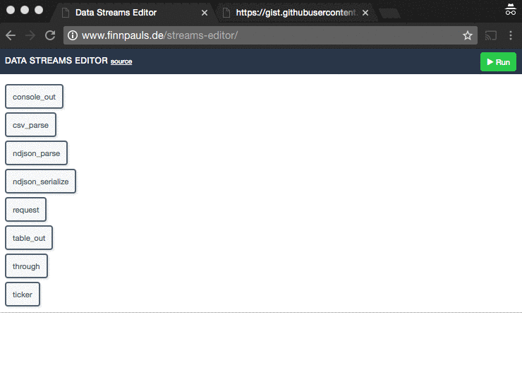

# Data Streams Editor

Data Streams Editor aims to make information gathering and archiving on the web user-friendly.
A simple user interface allows to create runnable network graphs.

## Preview:

Currently runs without a server/proxy, so only resources who allow cross-origin can be requested.

## Usage
Clone this repository and run:
`npm install`
`npm start`

You can view Data Streams Editor on http://localhost:9966/.
